# Java就该这么学

## 第一部分 认识Java程序
1.java纯粹的面向对象语言，程序是由一个一个类组成的
> java中类名大写
> MyTest.java

2.类名与文件名相同


源文件中有类名值 public 的话，文件名与该类同名。

3.java语言不能直接画在窗体上，必须是画布上才行，好在存在画布类

4.80%思考任务，20%思考知识

5.Math.random() 产生的是0-1之间的数字

6.传数值的时候，需要考虑是否需要强制类型转换

7.不要写成——T1.6
```java
int x[] = new int[300] ;
int y[] = new int[300] ;
//类里面不要直接写语句，应该放到方法里面
for(int i = 0 ; i < 300 ; i ++){
    x[i] = (int)(Math.random()*1024) ;
    y[i] = (int)(Math.random()*768) ;
}
```    
正确关系  


所以应该写成
```java
class MyPanel{
    int x[] = new int[300] ;
    int y[] = new int[300] ;

    public MyPanel(){
        for(int i = 0 ; i < 300 ; i ++){
            x[i] = (int)(Math.random()*1024) ;
            y[i] = (int)(Math.random()*768) ;
        }
    }
}
```

8.Ctrl+Shift+Alt+R——30s
```
gsettings set org.gnome.settings-daemon.plugins.media-keys max-screencast-length 60
以秒为单位将’60’值替换为您想要的长度，例如300分钟5分钟，600分钟10分钟等等。
```

9.一般java API规律
> 得到信息是 get 开头
> eg：getKeyCode()
>
> 改变信息是 set 开头
> eg:f.setSize(300, 400);

10.[实现KeyListener接口必须实现3个方法](Part1认识Java程序/1.7键盘控制小球/test/test1/README.md)

11.将字符转换成字符串方法
> 将字符c变成对象 new Character(c)
>
> 然后调用 toString() 方法
>
> ```new Character(c[i]).toString()```

## 第二部分 开始一个项目
### 一、页面的3种布局
#### 1.BorderLayout——边框布局管理器
> NORTH——北
>
> SOUTH——南
>
> WEST——西
>
> EAST——东
>
> CENTER——中间

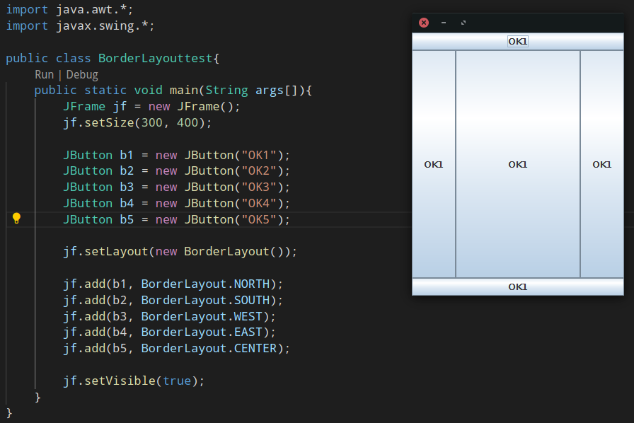

#### 2.GridLayout
> 事先算好行列的个数，从左到右，从上到下

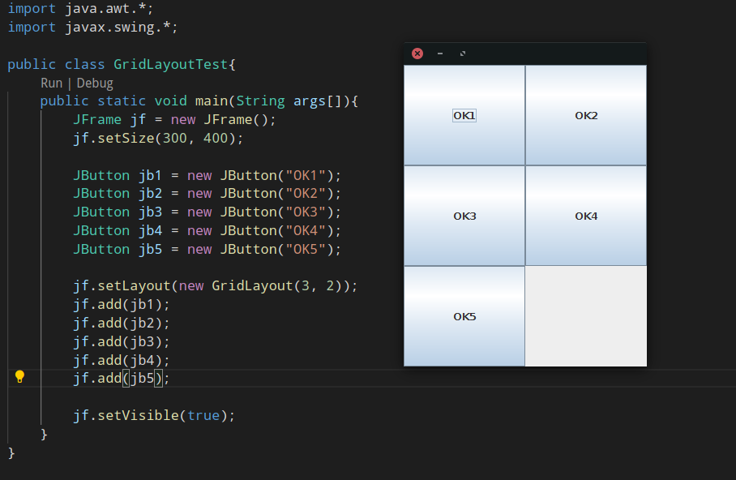

#### 3.FlowLayout
> 往中间排，一排不够换下一排

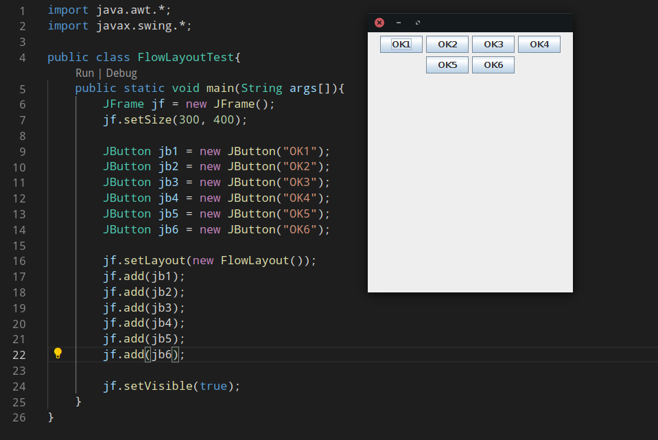
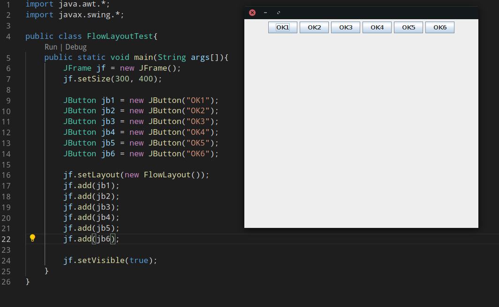
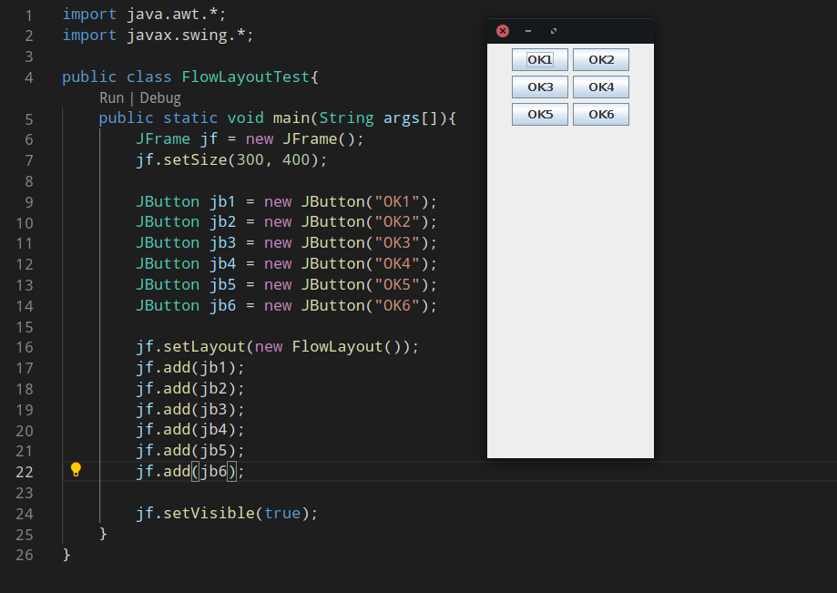
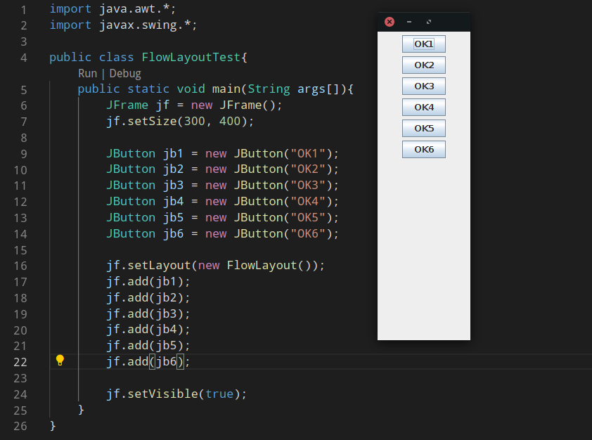

### 二、常用组件
Java采用布局的方式，而不是根据坐标

下面的所有组件最终都要放在 JFrame 上面。
#### 1.JPanel——画布
JPanel可以放在JFrame上面，也可以放在JPanel上面
#### 2.JLabel——文本提示

#### 3.JTextField——单行文本输入

#### 4.JPasswordField——密码
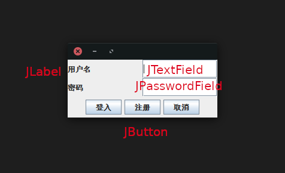

#### 5.JComboBox——下拉框

#### 6.JTextArea——多行文本输入

#### 7.JScrollpane——滚动条
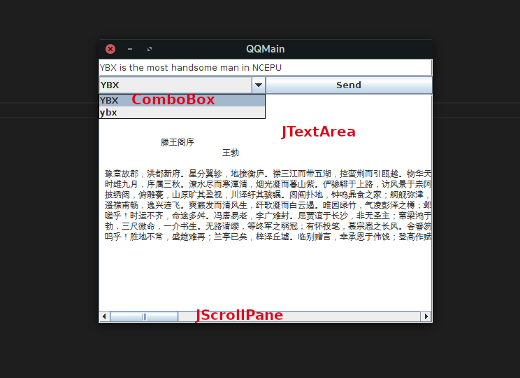


### 开始QQ项目
###### [实例1 QQ登入界面](Part2开始一个项目/2.1聊天界面/test5登入界面/QQLogin.java)

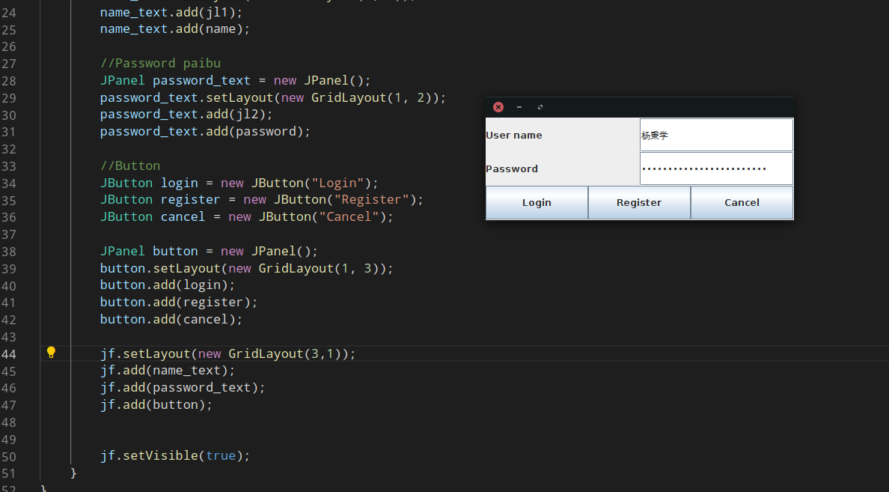


###### [实例2 QQ主界面](Part2开始一个项目/2.1聊天界面/test6主界面/QQMain.java)
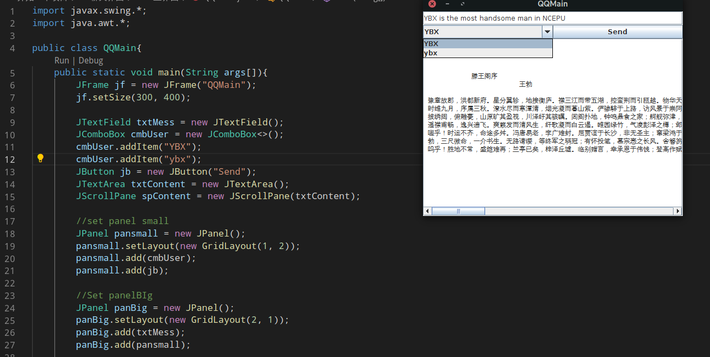

Java分为 **客户端** 与 **服务器端** 编程，这两者被互联网隔开，只能依赖简单的消息传递让两者一起工作。所以，不一定使用同一种技术开发两端，前端使用HTML(其实是HTML， CSS， JavaScript的统称)， 后端使用Java。

早期java也负责前端有一个组件——Applet，他可以嵌入到HTML里面，但后来Flash成功以后，Applet就没落了。

###### [实例3 QQ注册事件](Part2开始一个项目/2.2响应用户输入/test3注册事件(具体)/QQLogin.java)
/out.gif)

如果 getActionCommand 的内容和声明的时候不一致就会出错
/error.gif)

### 三、面向对象
#### 1.super 与 this
super 与 this 一样都是引用
> super 是指向父类的引用
>
> this 是指向当前的引用
>

#### 2.继承注意事项
```java
A c = new B();
```
这句话之后，结果是父类的成员变量，子类的方法。

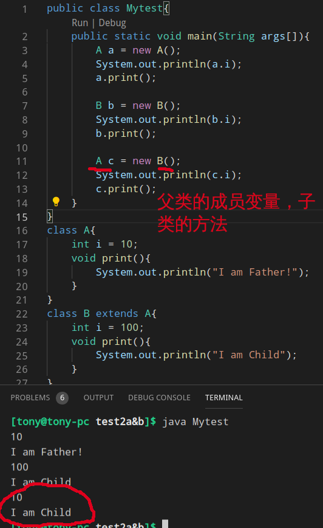

### 四、I/O流
语句是对CPU的操作，程序是在内存里面，操作内存比较方便，但是操作外设(键盘，硬盘，打印机，网络)就比较麻烦，程序想与他们打交道，需要用到**I/O流**

对I/O流的操作一般3步
> 1.定位<br>
> - 对于硬盘：到那个硬盘，那个目录大那个文件<br>
> - 对于网络：网络地址的那个端口
>
> 2.建立管道<br>
> 就是数据源的方向
>
> 3.操作管道<br>
> 所有离开内存的操作都是存在隐患的，需要```try{} ... catch(){}```<br>
> - 文件不存在<br>
> - 硬盘损坏<br>
> - 网络不通<br>
> - 数据库服务器没启动<br>
```java
import java.io.*;

public class MyReadFile {
	public static void main(String args[]){
		try{
			//Step1：定位数据源
			File f = new File("./test.txt") ;

			//Step2：建议管道
			FileInputStream fis = new FileInputStream(f) ;
			
			//Step3:操作管道
			int length = fis.available() ;
			for (int i = 0; i < length ; i ++ ) {
				System.out.print((char)fis.read()) ;
			}
		}catch(Exception e){}
	}
}
```

如果有时间可以看看 java 家目录里面的 src.zip 里面的java代码，都是开源人写的不错的代码

#### 复制大文件
首先对于 read 方法一共有3中方式重载

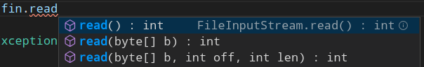

对于 write 方法也有3中方式重载

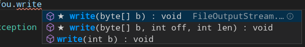

分析如果采用 [方式1](Part2开始一个项目/2.3IO流/test4复制大文件/test1实验1——挨个字节复制/MyReadBigFile.java) 的话需要复制21103945 次，浪费资源，时间

###### 采用 [方式2](Part2开始一个项目/2.3IO流/test4复制大文件/test2实验2——数组整块复制/MyReadBigFile.java)
缺点就是因为不是整除，所以复制的结果会更大一些，

建议数组长度采用2的n次方

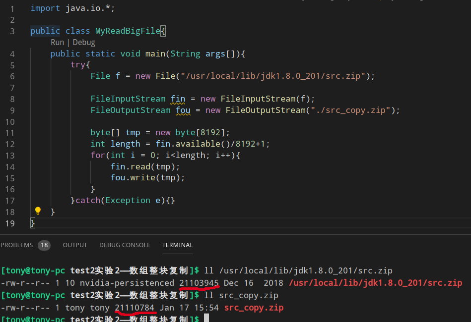

###### 采用[混合方式](Part2开始一个项目/2.3IO流/test4复制大文件/test3——混合方案/MyReadBigFile.java)
先用方式2大块复制减少时间，在用方式1 处理剩余的
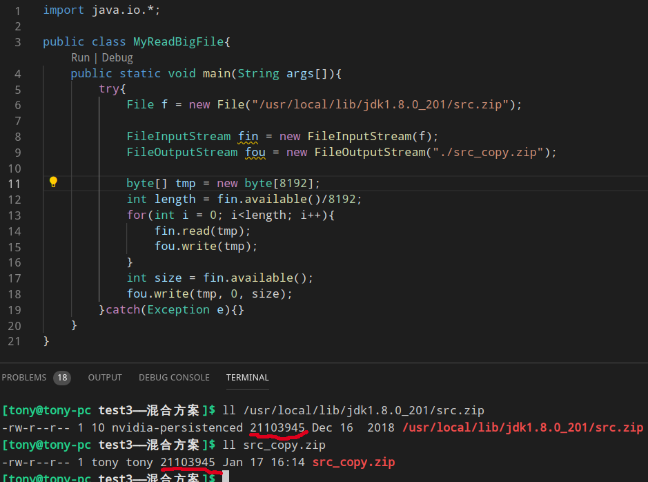

字节流操作```FileInputStream FileOutputStream```不能直接操作 Unicode 字符，不符合 Java “一次编写，处处运行”

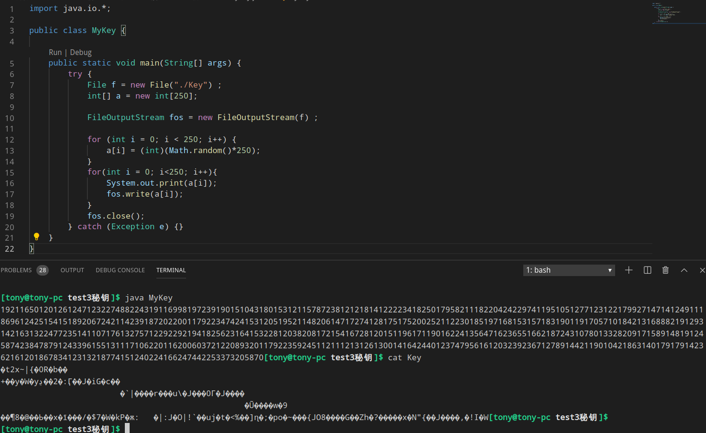

为了解决这个问题，需要提出——字符流

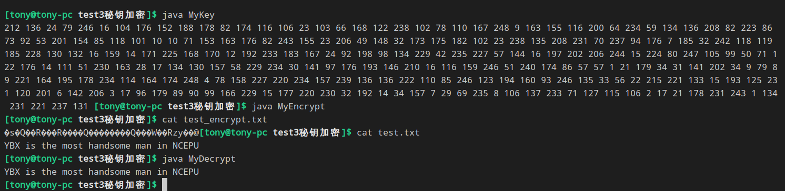

---
## 本书实例
1.[画乌龟](Part1认识Java程序/1.2画乌龟/Turtle.java)


2.[漫天星星](Part1认识Java程序/1.3满天星星/MyTest.java)


3.[飞行的小球](Part1认识Java程序/1.4飞行的小球/MyBall.java)


4.[小球撞墙](Part1认识Java程序/1.5小球撞墙/MyBall.java)


5.[下大雪](Part1认识Java程序/1.6下大雪/MySnow.java)


6.[键盘控制小球](Part1认识Java程序/1.7键盘控制小球/MyBall.java)


7.[打字游戏](Part1认识Java程序/1.8打字母的游戏/MyChar.java)


8.[鼠标控制小球](Part1认识Java程序/1.9鼠标控制小球/MyBall.java)

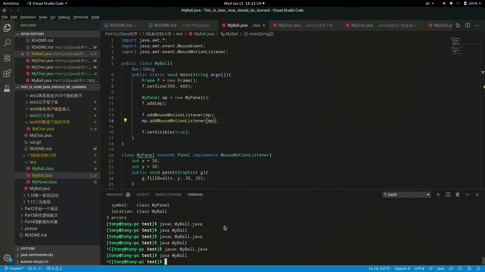
