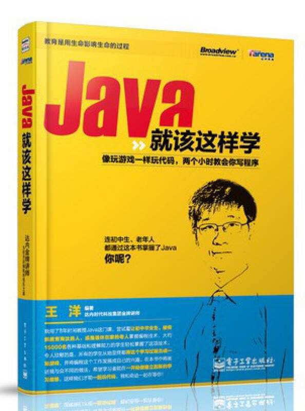
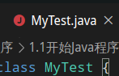
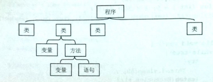
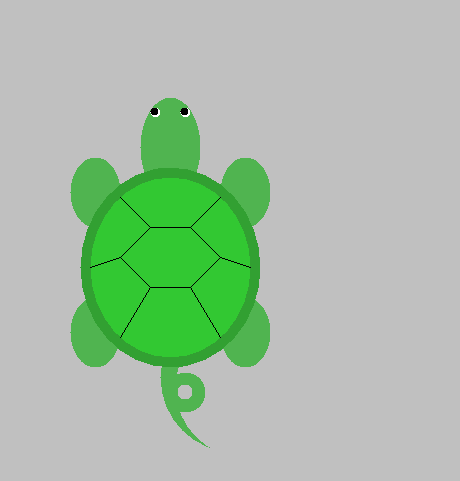
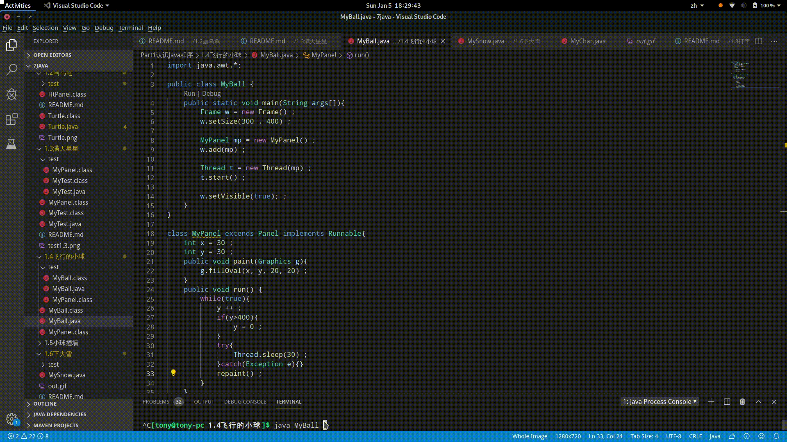
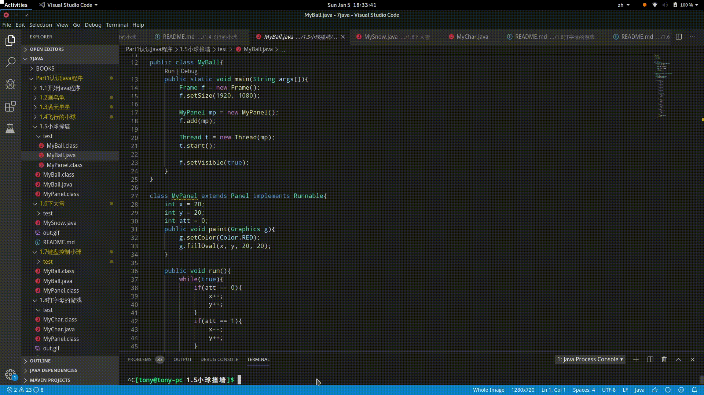
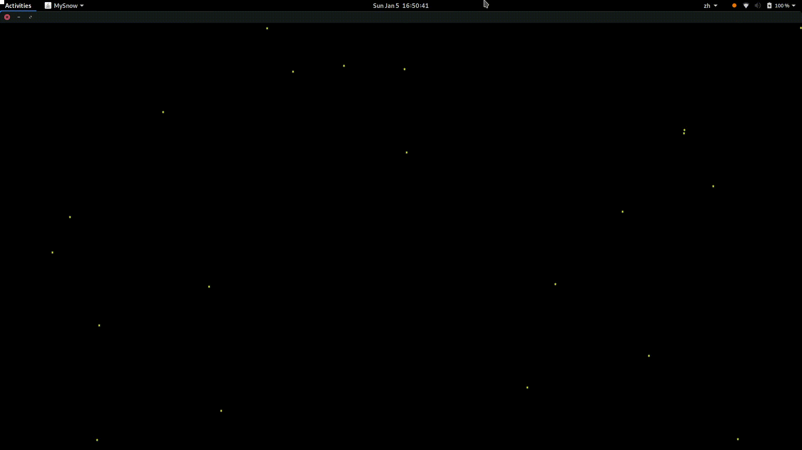
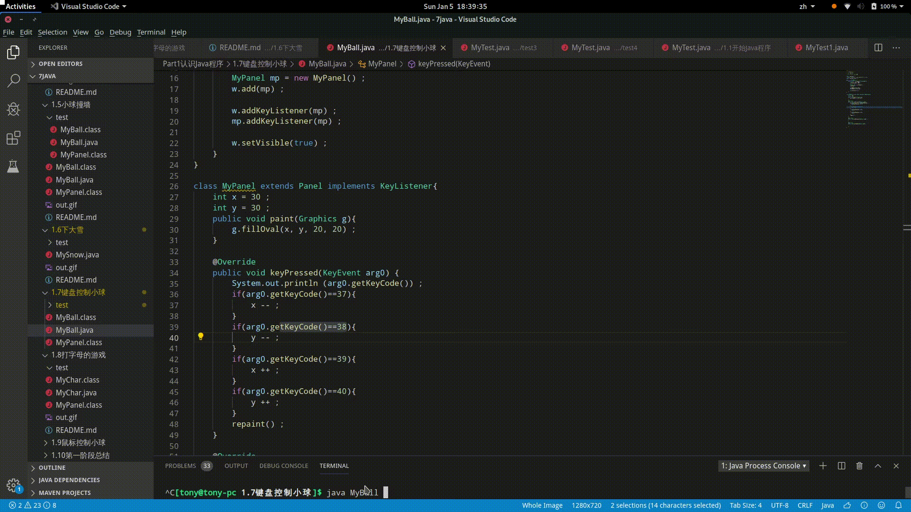
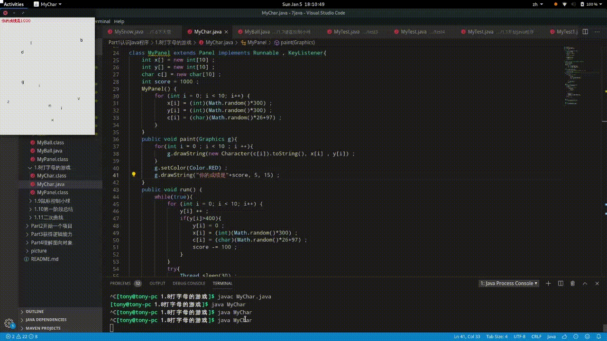

# Java就该这么学

## 第一部分 认识Java程序
1.java纯粹的面向对象语言，程序是由一个一个类组成的
> java中类名大写
> MyTest.java

2.类名与文件名相同


源文件中有类名值 public 的话，文件名与该类同名。

3.java语言不能直接画在窗体上，必须是画布上才行，好在存在画布类

4.80%思考任务，20%思考知识

5.Math.random() 产生的是0-1之间的数字

6.传数值的时候，需要考虑是否需要强制类型转换

7.不要写成——T1.6
```java
int x[] = new int[300] ;
int y[] = new int[300] ;
//类里面不要直接写语句，应该放到方法里面
for(int i = 0 ; i < 300 ; i ++){
    x[i] = (int)(Math.random()*1024) ;
    y[i] = (int)(Math.random()*768) ;
}
```    
正确关系  


所以应该写成
```java
class MyPanel{
    int x[] = new int[300] ;
    int y[] = new int[300] ;

    public MyPanel(){
        for(int i = 0 ; i < 300 ; i ++){
            x[i] = (int)(Math.random()*1024) ;
            y[i] = (int)(Math.random()*768) ;
        }
    }
}
```

8.Ctrl+Shift+Alt+R——30s
```
gsettings set org.gnome.settings-daemon.plugins.media-keys max-screencast-length 60
以秒为单位将’60’值替换为您想要的长度，例如300分钟5分钟，600分钟10分钟等等。
```

9.一般java API规律
> 得到信息是 get 开头
> eg：getKeyCode()
>
> 改变信息是 set 开头
> eg:f.setSize(300, 400);

10.[实现KeyListener接口必须实现3个方法](Part1认识Java程序/1.7键盘控制小球/test/test1/README.md)

11.将字符转换成字符串方法
> 将字符c变成对象 new Character(c)
>
> 然后调用 toString() 方法
>
> ```new Character(c[i]).toString()```


## 本书实例
1.画乌龟



2.漫天星星


3.飞行的小球



4.小球撞墙



5.下大雪



6.键盘控制小球



7.打字游戏


